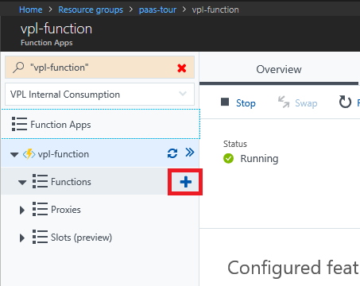
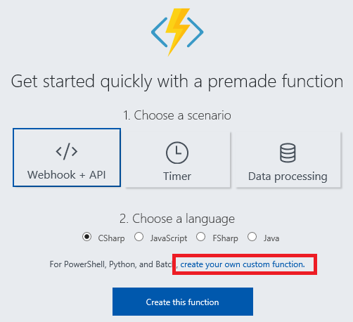
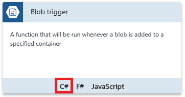
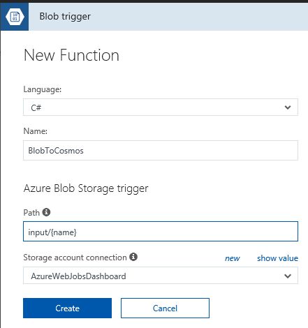
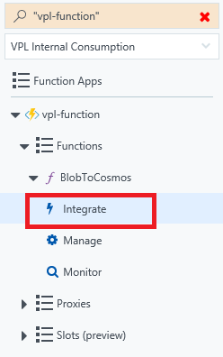
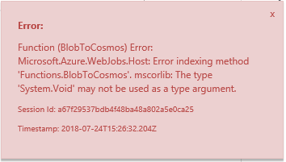

# Azure Functions

[Azure Functions](https://docs.microsoft.com/en-us/azure/azure-functions/functions-overview) is a serverless compute service.

One of the strenght of Azure Functions is its bindings.  It allows the function runtime to bind different Azure services.

We will implement a function which is triggered when a file is dropped in Blob Storage and push the content to Cosmos DB.  The code doesn't have any reference to neither Blob Storage nor Cosmos DB SDKs.  The connection to those services is assumed by the Function runtime.

First, let's open the function resource:


1. Let's hover next to *Functions* and click the **+** button:

1. Let's click the hyperlink *create your own custom function*:

1. Let's select the *Blob trigger* box *C#* link:

1. Let's fill the form as follow:
   * In *Name*, type *BlobToCosmos*
   * In *Path*, type *input/{name}*
   * Leave *Storage account connection* as is
1. Click Create

1. Let's select *Integrate* menu option:

1. Here we see that the trigger & input is blob storage
1. Let's add an output:  click *New Ouptut*

1. Let's select *Azure Cosmos DB* and click *Select*
1. Let's fill the form as follow:
   * Check the *Use function return value* box
   * As *Database name*, enter *mydb*
   * As *Collection Name*, enter *mycoll*
   * Check the *If true, creates the Azure Cosmos DB database and collection* box
   * In *Azure Cosmos DB account connection*, click *new*
     * Make sure your susbscription is selected
     * Select the Cosmos DB created for this demo
     * Click Select
1. Click *Save*

1. Let's go back to the code by clicking on *BlobToCosmos*

1. We should see the following error

This is normal as the current code doesn't have a return type and therefore can't be bound
1. Let replace the code by the following:
    ```
    #r "Newtonsoft.Json"

    using Newtonsoft.Json;

    public static async Task<object> Run(Stream myBlob, string name, TraceWriter log)
    {
        using (var reader = new StreamReader(myBlob))
        {
            var blobText = await reader.ReadToEndAsync();
            var blobObject = JsonConvert.DeserializeObject(blobText);
            
            log.Info($"C# Blob trigger function Processed blob\n Name:{name} \n Size: {myBlob.Length} Bytes");
            log.Info($"Blob content:  {blobText}");

            return new
            {
                fileName = name,
                processedBy = "Function",
                content = blobObject
            };
        }
    }
    ```
1. Hit *Save*
1. Let's add a blob container named *input* on the storage account within the resource group.  We can use either using the Portal or [Azure Storage Explorer](https://azure.microsoft.com/en-us/features/storage-explorer/).  The name, *input*, is important as we just configure our function to monitor that container.
