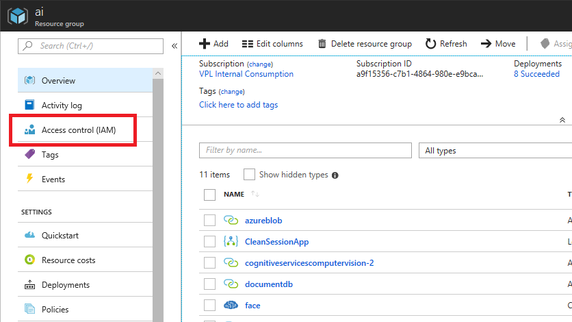
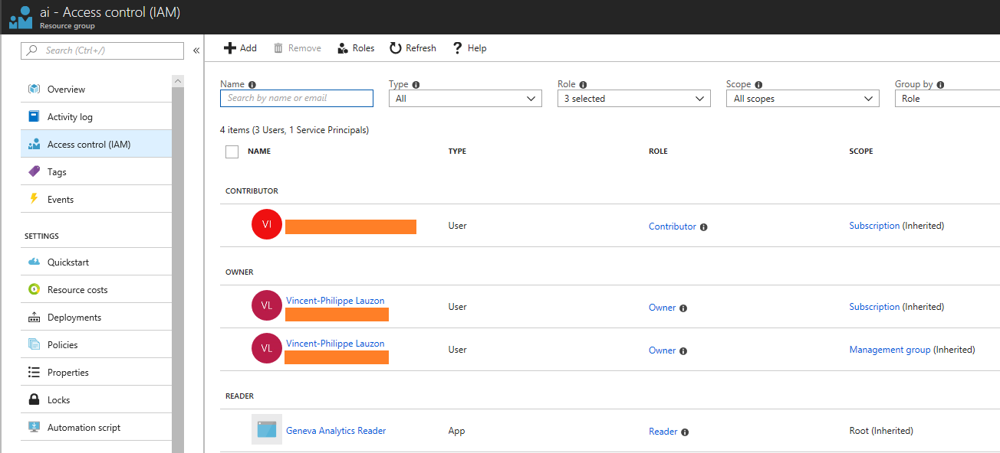
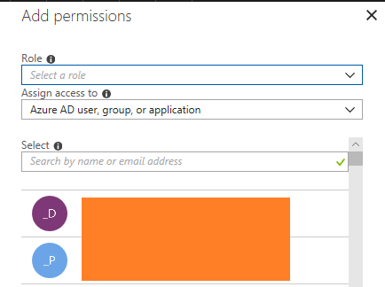
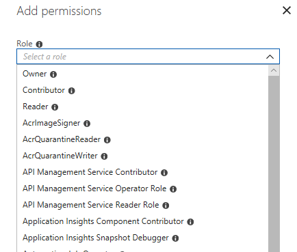
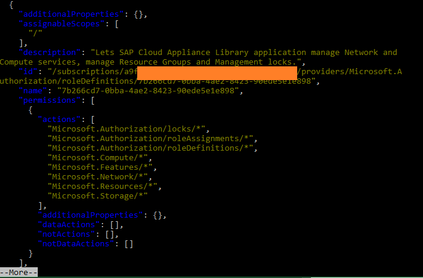
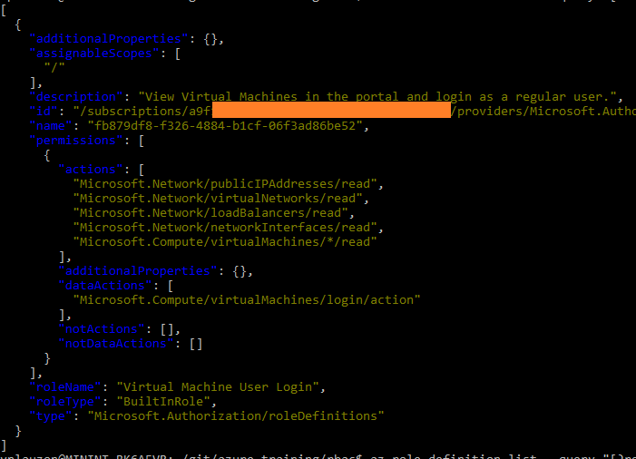

# Role Based Access Control (RBAC)

This lab does an introduction to Azure Resource Model (ARM).

## Lab objectives

Experience RBAC in the Portal.

## Prerequisites

We recommend going through our [ARM Introduction](https://github.com/vplauzon/azure-training/tree/master/arm-intro) lab.

## Assignation - Portal Experience

1. Go to http://portal.azure.com
1. Select *Resource Group* on the left-hand side menu
1. We should see a list of resource groups assuming our subscription isn't empty
1. Let's select a resource group
1. On the left menu, let's select *Access control (IAM)*

1. We can see the current RBAC settings:

    * Those are inherited settings
    * We see roles coming from both subscription and management group
    * We see three types of roles
        * Reader
        * Contributor
        * Owner
1. We obfuscated email addresses:  we shouldn't see those orange boxes in the portal
1. Let's add a new permission:  let's click the *Add* button on top of the pane
1. This brings a pop up like this one:

1. Let's look at the available roles:

1. Let's select *Reader*
1. In the *Assign access to* drop box, we can type the email of a colleague

We won't perform the assignment.  But basically, a permission is a role + a user (or a group).

When a permission is assigned to a resource group, it is inherited by underlying resources.  Similarly, a permission assigned to a subscription is inherited by underlying resource groups.

## Definitions - CLI

We've seen that RBAC permissions was about roles.  Let's look at role definitions.

1. Let's type `az role definition list -o table | less`
1. This gives us the list of default roles:

1. This tabular format is convenient but hides some field, let's type:
`az role definition list -o jsonc | more`
1. This gives us more verbose definitions, including the actions allowed by the role

1. An action correspond to an individual REST API call that can be performed by a user.  In the example above, wildcards (*) are used.  Let's look at a more specific one:
`az role definition list --query "[?roleName == 'Virtual Machine User Login']" -o jsonc`
1. This gives us the definition of the role *Virtual Machine User Login*:

1. We see that those include only read actions

## Custom roles

It is possible to create custom roles by aggregating actions.  We will not do that here.

[Online Documentation](https://docs.microsoft.com/en-us/azure/role-based-access-control/custom-roles) cover that topic.